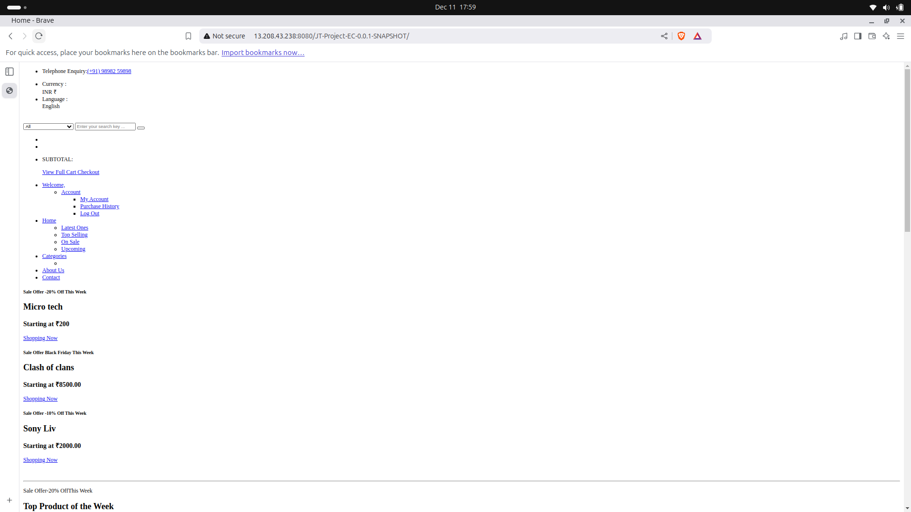

# Setting Up Your EC2 Instance

## Create an EC2 Instance:
1. Log in to the AWS Console.
2. Launch a new EC2 instance (preferably Ubuntu or Amazon Linux 2).
3. Choose the appropriate instance type.
4. Create and assign a security group allowing SSH (port 22) and HTTP/HTTPS (ports 80/443).
5. Download the `.pem` key pair for SSH access.

## Connect to the EC2 Instance:
Use the following command to SSH into the EC2 instance:
```bash
ssh -i "barcode_app.pem" ubuntu@ec2-15-168-12-61.ap-northeast-3.compute.amazonaws.com
```


# Installing Java JDK 21 on Ubuntu

### **Step 1: Update Package List**
Before installing any package, update the package list to ensure you have the latest repository information:
```bash
sudo apt update
```

### **Step 2: Install OpenJDK 21**
To install OpenJDK 21, run the following command:
```bash
sudo apt install openjdk-21-jdk -y
```
This will install **OpenJDK 21** along with the necessary development tools.

### **Step 3: Verify the Installation**
After installation, verify that Java 21 is installed correctly:


# Installing Maven

### **Step 1: Update Package List**
Start by updating the package list:
```bash
sudo apt update
```

### **Step 2: Install Maven**
Install Maven directly from the Ubuntu repositories:
```bash
sudo apt install maven -y
```
This will install the latest stable version of Maven from the official Ubuntu package repository.


# Clone the Repository
Clone the repository for the Train Ticket Reservation System:
```bash
git clone https://github.com/NareshNarayanadasu/java_ecomm_app.git
```

# Installing MySQL

### **Step 1: Update the Package List**
Update the package list to fetch the latest MySQL packages:
```bash
sudo apt update
```

### **Step 2: Install MySQL Server**
Install MySQL Server:
```bash
sudo apt install mysql-server -y
```
This will install MySQL 8.2 (or the latest available version in the MySQL 8.x series).

### **Step 3: Verify the Installation**
Check the MySQL version:
```bash
mysql --version
```

### **Start MySQL**
Start and enable MySQL to run on boot:
```bash
sudo systemctl start mysql
sudo systemctl enable mysql
sudo systemctl status mysql
```


### To create a MySQL database (`ecommerce_store`) and set up a root user with the appropriate credentials, follow these steps:

### **Steps to Set Up MySQL for the `ecommerce_store` Application**

#### 1. **Access MySQL as the Root User**
Log in to your MySQL server using the root account. Open a terminal and run:
```bash
mysql -u root -p
```
Enter the root password when prompted.

---

#### 2. **Create the Database**
Run the following command to create the database:
```sql
CREATE DATABASE ecommerce_store;
```

---

#### 3. **Create a User (Optional)**  
If you want to use a dedicated user instead of the root user for security reasons, create a new user:
```sql
CREATE USER 'your-username'@'localhost' IDENTIFIED BY 'your-password';
```

---

#### 4. **Grant Permissions**
Grant all privileges on the `ecommerce_store` database to the specified user:
```sql
GRANT ALL PRIVILEGES ON ecommerce_store.* TO 'your-username'@'localhost';
```
If you’re using the root user, this step isn’t necessary since it already has full privileges.

---

#### 5. **Flush Privileges**
Apply the changes by flushing privileges:
```sql
FLUSH PRIVILEGES;
```

---

#### 6. **Verify Access**
Exit the MySQL shell and log in using the new user (if applicable) to verify access:
```bash
mysql -u your-username -p
```
Then, test access to the database:
```sql
USE ecommerce_store;
```

---

#### 7. **Update the Application Properties**
Replace the placeholder values in your `application.properties` file with the actual credentials:
```properties
# Updated database configuration
spring.datasource.url=jdbc:mysql://localhost:3306/ecommerce_store
spring.datasource.username=your-username
spring.datasource.password=your-password
spring.datasource.driver-class-name=com.mysql.cj.jdbc.Driver

# Hibernate configuration
spring.jpa.hibernate.ddl-auto=update

# Removed older properties for cleanup
# spring.datasource.name and spring.jpa.properties.hibernate.dialect are omitted
# If required, add the dialect:
# spring.jpa.properties.hibernate.dialect=org.hibernate.dialect.MySQL8Dialect (recommended for MySQL 8 or higher)

# JSP configuration (if using JSP)
spring.mvc.view.suffix=.jsp

# Optional logging levels (uncomment if needed)
# logging.level.org.springframework=OFF
# logging.level.root=OFF

```

---


# Build the Project
Navigate to the `JavaSpringBoot-E-Commerce` directory:
```bash
cd JavaSpringBoot-E-Commerce
```

Run specific Maven goals (clean and install):
```bash
mvn clean package
```

# Installing JBoss (WildFly) on Ubuntu

## Prerequisites

### **Install Java Development Kit (JDK)**
Ensure you have a JDK installed:
```bash
sudo apt install default-jdk
```

### **Create a Dedicated User Account**
Create a user account to run WildFly:
```bash
sudo groupadd wildfly
sudo useradd -r -g wildfly -d /opt/wildfly -s /sbin/nologin wildfly
```

## Download and Extract WildFly
Download the WildFly `.tar.gz` file:
```bash
wget https://github.com/wildfly/wildfly/releases/download/34.0.1.Final/wildfly-34.0.1.Final.tar.gz
```

Extract the downloaded archive:
```bash
sudo tar -xzvf wildfly-34.0.1.Final.tar.gz -C /opt/
```

Set the appropriate permissions:
```bash
sudo chown -R wildfly:wildfly /opt/wildfly-34.0.1.Final
```

## Configure Systemd Service
Create a systemd service file for WildFly:
```bash
sudo nano /etc/systemd/system/wildfly.service
```

Add the following content to the file:
```ini
[Unit]
Description=WildFly Application Server
After=network.target

[Service]
User=wildfly
Group=wildfly
WorkingDirectory=/opt/wildfly-34.0.1.Final/bin
ExecStart=/opt/wildfly-34.0.1.Final/bin/standalone.sh -b 0.0.0.0
ExecStop=/opt/wildfly-34.0.1.Final/bin/standalone.sh -S

[Install]
WantedBy=multi-user.target
```

### To copy the target/*.war file to the JBoss default deployment directory, you can use the following command:

```bash
sudo cp /JavaSpringBoot-E-Commerce/target/*.war /opt/wildfly-34.0.1.Final/standalone/deployments/
```

## Start and Enable WildFly
Start and enable WildFly:
```bash
sudo systemctl daemon-reload
sudo systemctl start wildfly
sudo systemctl enable wildfly
```

Check the status of WildFly:
```bash
sudo systemctl status wildfly
```


## Access the WildFly Management Console
Open a web browser and navigate to:
```
http://http://15.152.44.240:8080/
```


### **Verify Deployment**
- **Check the Server Log**: Look for deployment messages.
- **Access the Application**: Use the appropriate URL, e.g., `http://localhost:8080/your-app-name`.
WildFly deployments are typically located in the `standalone/deployments` directory of the WildFly installation path, as seen in your example:

```bash
/opt/wildfly-34.0.1.Final/standalone/deployments
```

---

### **Deployment Files in WildFly**
1. **`.war` File**:
   - Your deployed application: `JT-Project-EC-0.0.1-SNAPSHOT.war`.
   - This is the main web application archive that contains the application's code, libraries, and configuration files.

2. **`.deployed` Marker File**:
   - `JT-Project-EC-0.0.1-SNAPSHOT.war.deployed` indicates that WildFly has successfully deployed the application.
   - If the deployment fails, you may see files like `.failed` or `.undeployed` instead.

3. **README.txt**:
   - A standard file for basic deployment instructions or information about this folder.

---

### **How to Access the Deployed Application**
1. **Check the WildFly Configuration**:
   - Ensure the WildFly server is running.
   - Default port: `8080` (can be customized in `standalone.xml` or `domain.xml`).

2. **Access URL**:
   - If the server IP is `172.31.33.182` and the app is running on the default port, the URL would be:
     ```
     http://172.31.33.182:8080/JT-Project-EC-0.0.1-SNAPSHOT
     ```



---

### **If You Want to Reconfigure the Deployment Location**
1. **Modify WildFly Configuration**:
   - Open the `standalone.xml` file located in:
     ```
     /opt/wildfly-34.0.1.Final/standalone/configuration/standalone.xml
     ```
   - Look for the `<deployments>` directory path in the configuration and update it if needed:
     ```xml
     <deployments path="/custom/path/to/deployments"/>
     ```

2. **Restart WildFly**:
   - After making changes, restart the WildFly server:
     ```bash
     ./bin/standalone.sh
     ```

---

