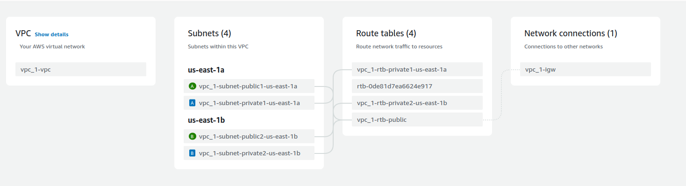

### **Project Overview: Real-Time Web Application in AWS VPC**

This project involves setting up a real-time web application hosted in an **Amazon Web Services (AWS) Virtual Private Cloud (VPC)**. The application will serve requests over the internet in real-time, using a secure, scalable, and modular infrastructure. This guide will walk you through the setup step by step.

---

### **Goals**

- Create a custom **VPC**.
- Set up **public** and **private subnets**.
- Configure routing and internet connectivity using an **Internet Gateway** and **Route Tables**.
- Apply access rules using **Network ACLs**.
- Deploy a **web server** on an EC2 instance within the VPC.

---

### **Step-by-Step Guide**

#### **Step 1: Create a VPC**

1. **Log in to AWS Management Console:**
   - Open the AWS Console and navigate to the **VPC Dashboard**.

2. **Create a New VPC:**
   - Click **Create VPC**.
   - Configure the following:
     - **Name Tag:** `MyVPC`
     - **IPv4 CIDR Block:** `10.0.0.0/16`
     - **Tenancy:** Default
   - Click **Create** to finish.


#### **Step 2: Create Subnets**

1. **Create a Public Subnet:**
   - Go to the **Subnets** section in the VPC Dashboard.
   - Click **Create Subnet** and configure:
     - **Name Tag:** `PublicSubnet`
     - **VPC ID:** Select `MyVPC`.
     - **Availability Zone:** Choose one (e.g., `us-east-1a`).
     - **IPv4 CIDR Block:** `10.0.1.0/24`
   - Click **Create**.

2. **Create a Private Subnet:**
   - Repeat the above steps to create a second subnet with the following details:
     - **Name Tag:** `PrivateSubnet`
     - **IPv4 CIDR Block:** `10.0.2.0/24`
     - Use the same or a different Availability Zone.

#### **Step 3: Set Up an Internet Gateway**

1. **Create the Internet Gateway (IGW):**
   - Navigate to the **Internet Gateways** section.
   - Click **Create Internet Gateway**.
   - Configure the **Name Tag** as `MyIGW`.
   - Click **Create**.

2. **Attach the IGW to the VPC:**
   - Select the created Internet Gateway, click **Actions**, and then **Attach to VPC**.
   - Select `MyVPC` from the dropdown and click **Attach**.

#### **Step 4: Configure Route Tables**

1. **Create a Public Route Table:**
   - Go to the **Route Tables** section.
   - Click **Create Route Table** and configure:
     - **Name Tag:** `PublicRT`
     - **VPC ID:** Select `MyVPC`.
   - Click **Create**.

2. **Add a Route to the Public Route Table:**
   - Select `PublicRT`, go to the **Routes** tab, and click **Edit Routes**.
   - Add the following route:
     - **Destination:** `0.0.0.0/0`
     - **Target:** `MyIGW` (Internet Gateway).
   - Click **Save Changes**.

3. **Associate Public Subnet with Public Route Table:**
   - Select `PublicRT` and go to the **Subnet Associations** tab.
   - Click **Edit Subnet Associations** and select `PublicSubnet`.
   - Click **Save**.

4. **Private Route Table (Optional):**
   - No additional routes are required for the private subnet unless a **NAT Gateway** is needed for outbound traffic.

#### **Step 5: Set Up Network ACLs**

1. **Create a Network ACL:**
   - Navigate to the **Network ACLs** section.
   - Click **Create Network ACL** and configure:
     - **Name Tag:** `MyNACL`
     - **VPC ID:** Select `MyVPC`.
   - Click **Create**.

2. **Configure Inbound Rules:**
   - Select `MyNACL` and go to the **Inbound Rules** tab.
   - Click **Edit Inbound Rules** and add:
     - **Rule #100:** Allow HTTP (TCP, Port 80) from `0.0.0.0/0`.
     - **Rule #110:** Allow HTTPS (TCP, Port 443) from `0.0.0.0/0`.

3. **Configure Outbound Rules:**
   - Go to the **Outbound Rules** tab and add:
     - **Rule #100:** Allow all outbound traffic to `0.0.0.0/0`.

4. **Associate NACL with Public Subnet:**
   - Go to the **Subnet Associations** tab of `MyNACL`.
   - Click **Edit Subnet Associations** and select `PublicSubnet`.
   - Click **Save**.

#### **Step 6: Launch an EC2 Instance**

1. **Launch an EC2 Instance:**
   - Go to the **EC2 Dashboard** and click **Launch Instance**.
   - Choose the following:
     - **AMI:** Amazon Linux 2.
     - **Instance Type:** `t2.micro`.
     - **Network Settings:** Select `MyVPC` and `PublicSubnet`.
     - **Security Group:** Allow SSH (Port 22) and HTTP (Port 80).

2. **Allocate a Public IP (If not automatically assigned):**
   - During instance launch, ensure the public IP setting is enabled.

3. **Launch and Note the Public IP Address:**
   - Complete the wizard and launch the instance.
   - After it is running, note its **Public IP Address**.

#### **Step 7: Deploy a Simple Web Application**

1. **SSH into the EC2 Instance:**
   - Use the following command, replacing placeholders:
     ```bash
     ssh -i your-key.pem ec2-user@142.16.2.19
     ```

2. **Install Apache Web Server:**
   ```bash
   sudo yum update -y
   sudo yum install -y httpd
   ```

3. **Start and Enable the Web Server:**
   ```bash
   sudo systemctl start httpd
   sudo systemctl enable httpd
   ```

4. **Deploy a Simple HTML Page:**
   ```bash
   echo "<html><h1>Welcome to My VPC Web App</h1></html>" | sudo tee /var/www/html/index.html
   ```

5. **Test Your Application:**
   - Open a browser and navigate to `http://142.16.2.19` to view the deployed page.

---

### **Conclusion**

You have successfully created a secure VPC, configured public and private subnets, established internet access via an Internet Gateway, and deployed a simple web application on an EC2 instance. This setup showcases how various AWS networking components work together to provide a robust environment for hosting applications.