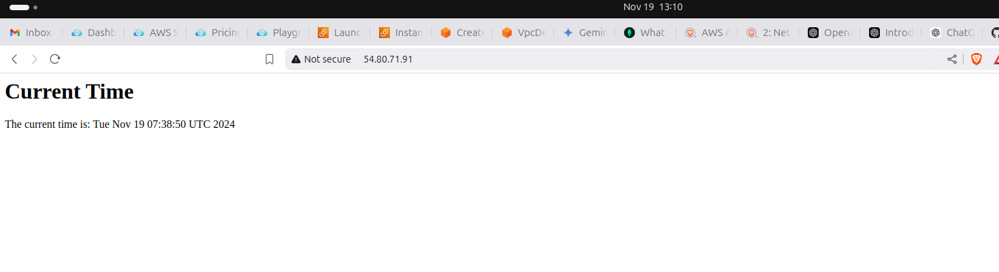
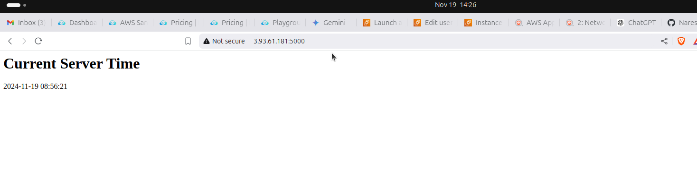

### **Project Overview: Real-Time Web Application with User Data**

This project demonstrates how to deploy a web application on an EC2 instance using a **User Data script**. The application will display real-time information, such as the current time, on a webpage. The process automates the server setup, reducing manual configurations.

---

### **Step-by-Step Guide**

#### **Step 1: Launch an EC2 Instance with User Data**

1. **Log in to AWS Management Console:**
   - Navigate to the **EC2 Dashboard**.

2. **Launch an Instance:**
   - Click on **Launch Instance**.
   - Choose an **Amazon Machine Image (AMI)**:
     - Select **Amazon Linux 2** (Free Tier eligible).
   - Choose an **Instance Type**:
     - Select `t2.micro` for Free Tier eligibility.

3. **Add a User Data Script:**
   - In the **Configure Instance Details** section, locate the **User Data** field.
   - Enter the following script to automate web server installation and configuration:

     ```bash
     #!/bin/bash
     yum update -y
     yum install -y httpd
     systemctl start httpd
     systemctl enable httpd

     # Create a simple HTML page that displays the current time
     echo "<html><body><h1>Current Time</h1><p>The current time is: $(date)</p></body></html>" > /var/www/html/index.html
     ```


4. **Set Up the Security Group:**
   - Allow **Inbound Rules** for:
     - **HTTP (Port 80)** for public access to the web server.
     - **SSH (Port 22)** for secure shell access to the instance.

5. **Key Pair for Access:**
   - Select or create a **Key Pair** for SSH access to the instance.
   - Keep the key file (`.pem`) secure and download it if creating a new one.

6. **Review and Launch:**
   - Verify all configurations and click **Launch**.

---



#### **Step 2: Access the Web Application**

1. **Get the Instance Public IP:**
   - Once the instance is running, locate its public IP (e.g., `136.9.21.1`) from the **Instances** section of the EC2 dashboard.

2. **View the Application in a Browser:**
   - Open a web browser and navigate to:
     ```
     http://136.9.21.1
     ```
   - You should see a webpage displaying the current time.

---

#### **Step 3: Verify the Configuration**

1. **SSH into the EC2 Instance:**
   - Use the public IP to connect to the instance:
     ```bash
     ssh -i your-key.pem ec2-user@136.9.21.1
     ```

2. **Check the Web Server Status:**
   - Verify that the Apache HTTP server is running:
     ```bash
     sudo systemctl status httpd
     ```

3. **View the Generated HTML File:**
   - Confirm that the HTML file was created and contains the current time:
     ```bash
     cat /var/www/html/index.html
     ```

---

### **Conclusion**

You have successfully deployed a real-time web application using an EC2 instance and a **User Data script**. This setup demonstrates how to automate server initialization and web application deployment at instance startup. The webpage at `http://136.9.21.1` dynamically displays the current time.