# **Real-Time Chat Application Using AWS EC2 with EFS**

---

## **Objective**
This guide demonstrates how to build and deploy a real-time chat application hosted on AWS. The backend will use Node.js, and data persistence will be managed with AWS Elastic File System (EFS) to ensure scalability and reliability.

---

## **Step-by-Step Instructions**

---

### **Step 1: Create an EFS File System**

1. **Log in to the AWS Management Console** and navigate to the **Elastic File System (EFS)** service.

2. **Create a New File System**:
   - Click **Create file system**.
   - Ensure the file system resides in the same VPC as your EC2 instances.
   - Note the **File System ID** for later use.
   - Click **Create file system**.
   
   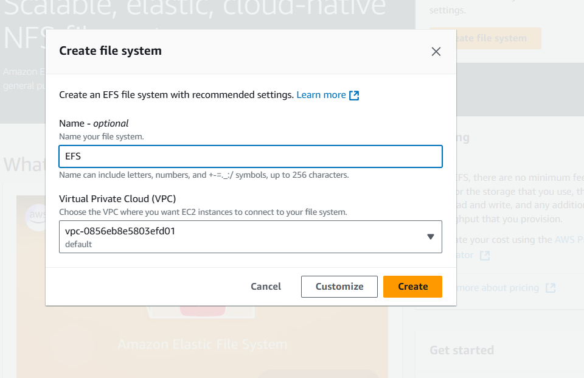  
   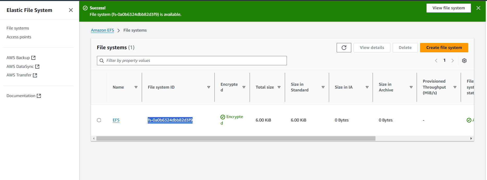  
   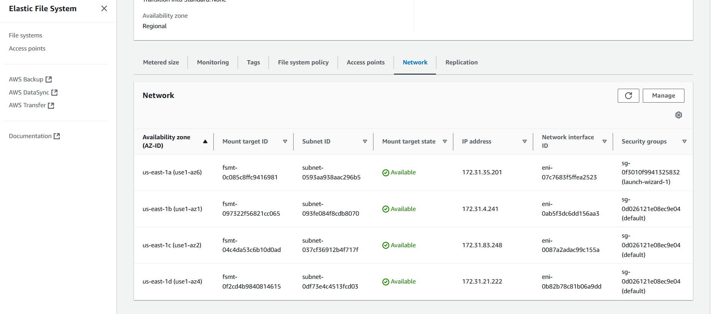

---

### **Step 2: Create and Launch EC2 Instances**

1. **Navigate to the EC2 Dashboard** in the AWS Management Console.

2. **Launch EC2 Instances**:
   - Click **Launch Instance**.
   - Choose an AMI, such as **Amazon Linux 2**.
   - Select an instance type (e.g., `t2.micro` for free tier eligibility).
   - Configure the instance to be in the same VPC as your EFS.
   - Set up a security group allowing inbound traffic on **port 22** (SSH) and **port 3000** (for the chat application).

   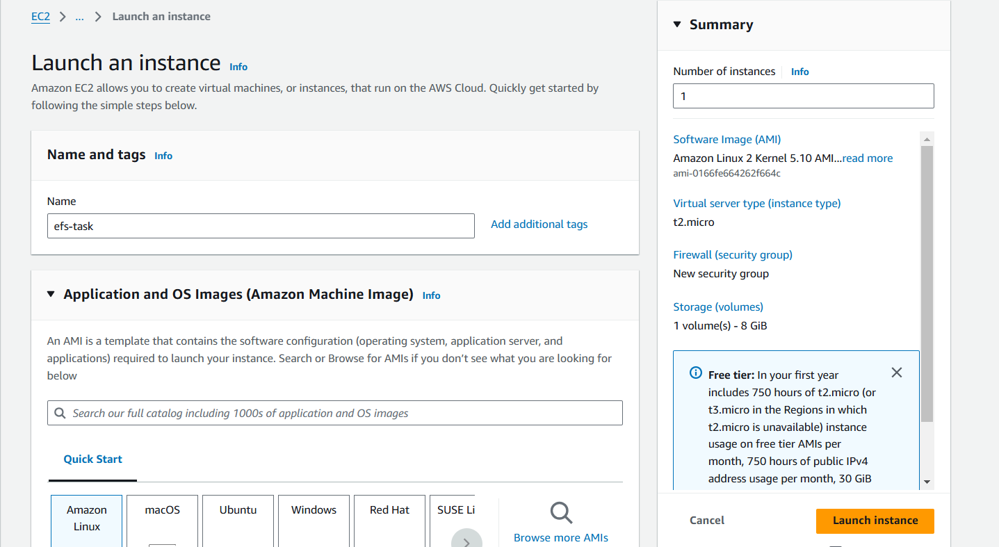  
   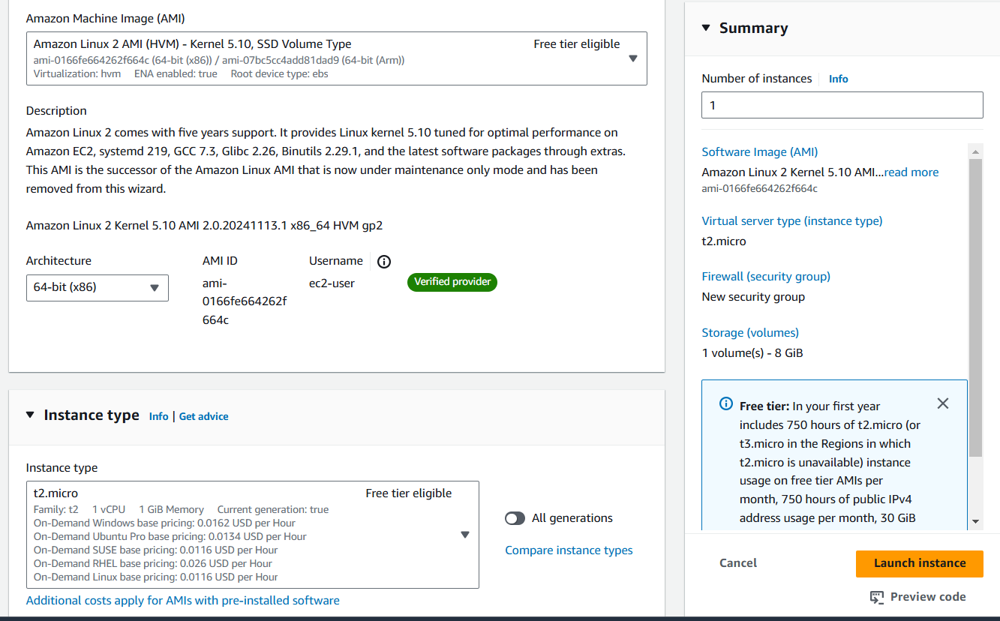  
   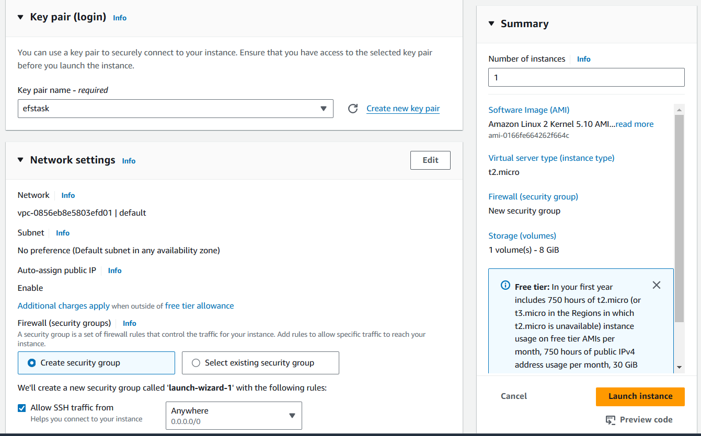  
   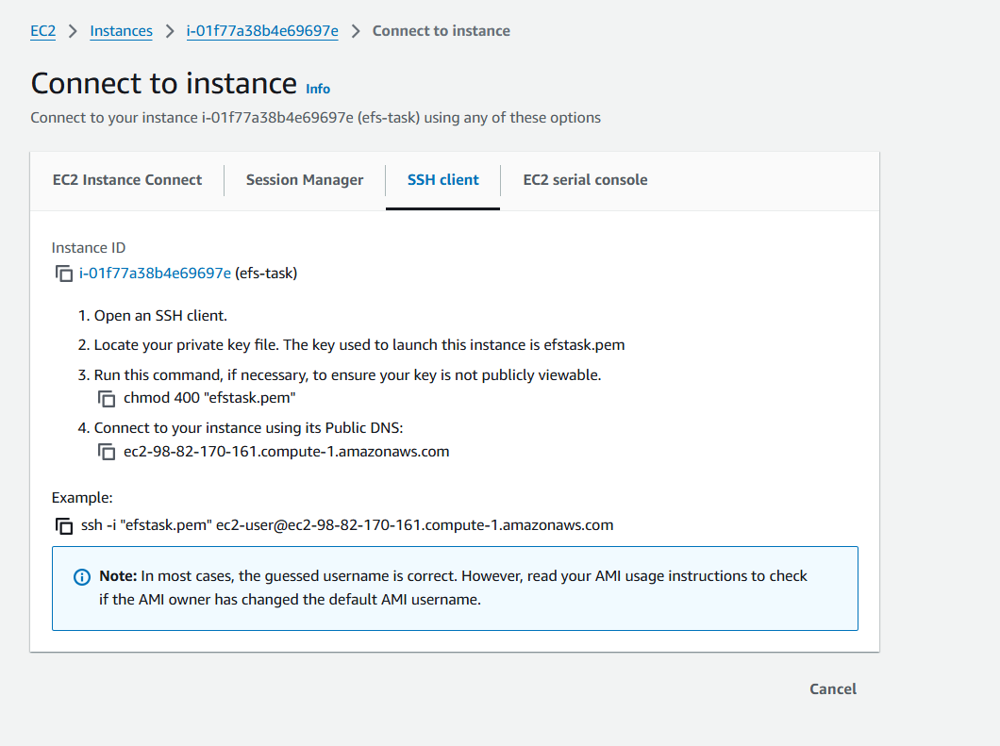

---

### **Step 3: Mount EFS on EC2 Instances**

1. **SSH into the EC2 Instance**:
   ```bash
   ssh -i your-key.pem ec2-user@your-instance-public-dns
   ```
   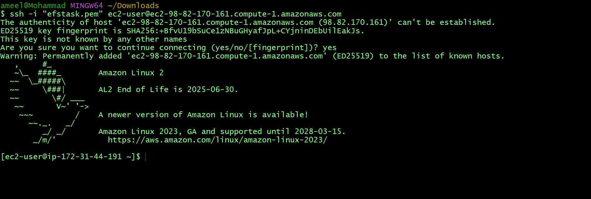

2. **Install the EFS Utilities**:
   ```bash
   sudo yum install -y amazon-efs-utils
   ```

3. **Create a Mount Point**:
   ```bash
   sudo mkdir /mnt/efs
   ```
   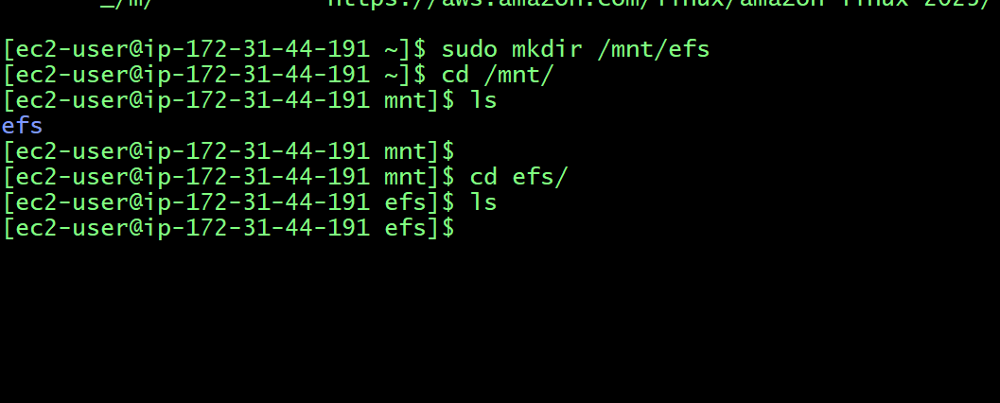

4. **Mount the EFS File System**:
   Replace `fs-XXXXXX` with your EFS File System ID.
   ```bash
   sudo mount -t efs fs-XXXXXX:/ /mnt/efs
   ```
   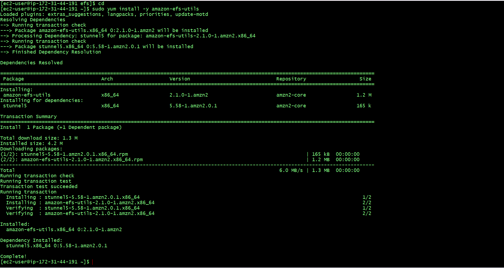

5. **Ensure EFS is Mounted on Reboot**:
   - Edit the `fstab` file to add the following entry:
     ```bash
     echo "fs-XXXXXX:/ /mnt/efs efs defaults,_netdev 0 0" | sudo tee -a /etc/fstab
     ```
   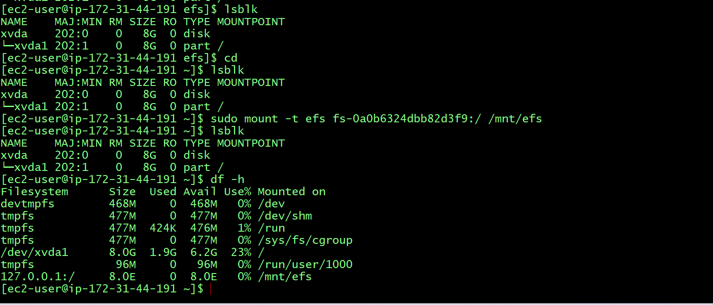  
   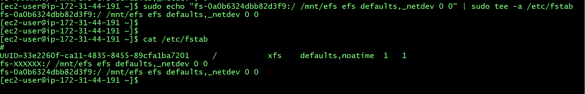

---

### **Step 4: Set Up the Node.js Application**

#### **Optional: Install and Manage Node.js Versions with NVM**
1. **Install NVM**:
   ```bash
   curl -o- https://raw.githubusercontent.com/nvm-sh/nvm/v0.39.5/install.sh | bash
   ```

2. **Activate NVM**:
   Add the following lines to your `~/.bashrc` or `~/.bash_profile` file:
   ```bash
   export NVM_DIR="$HOME/.nvm"
   [ -s "$NVM_DIR/nvm.sh" ] && \. "$NVM_DIR/nvm.sh"
   ```
   Reload the shell:
   ```bash
   source ~/.bashrc
   ```

3. **Install Node.js**:
   ```bash
   nvm install 16
   nvm use 16
   ```

4. **Verify Installation**:
   ```bash
   node -v
   npm -v
   ```
   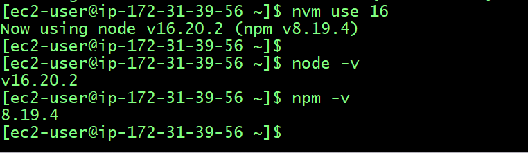

---

#### **Initialize and Develop the Application**
1. **Initialize a Node.js Project**:
   ```bash
   npm init -y
   ```
   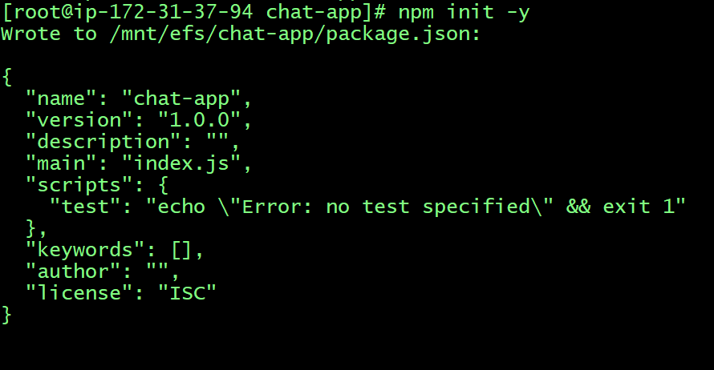

2. **Install Required Packages**:
   ```bash
   npm install express ws body-parser
   ```

3. **Create the Server**:
   - Create a file named `server.js` with the following content:
     ```javascript
     // server.js code as described earlier
     ```

4. **Create a Simple HTML Client**:
   - In a directory named `public`, create `index.html` with the following:
     ```html
     // index.html code as described earlier
     ```

---

### **Step 5: Run and Access the Application**

1. **Start the Server**:
   ```bash
   node server.js
   ```
   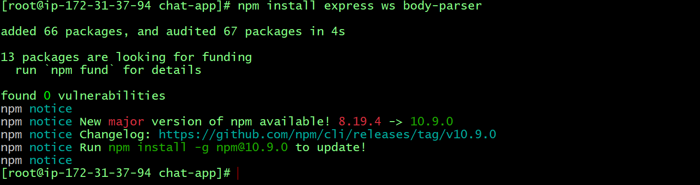  
   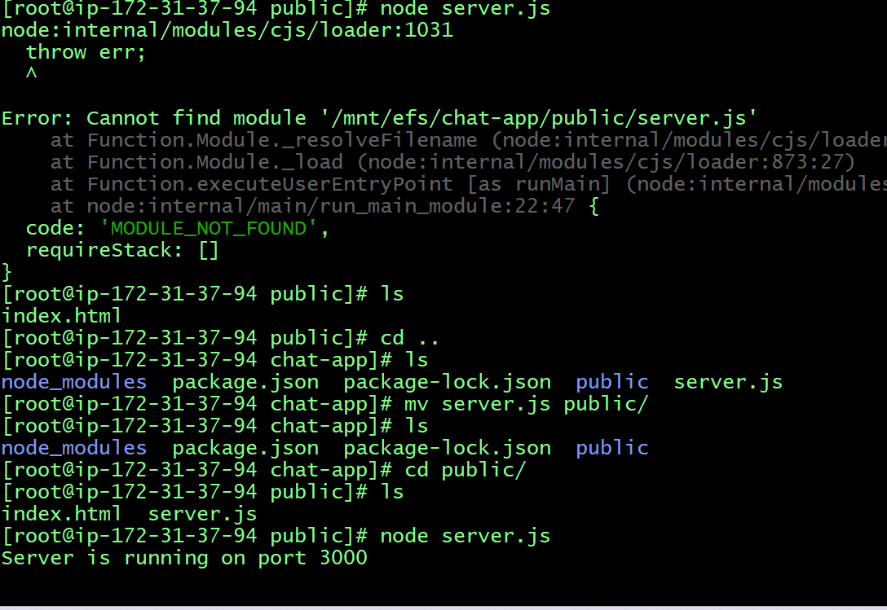

2. **Access the Application**:
   - Open a web browser and navigate to:
     ```
     http://<your-instance-public-dns>:3000
     ```
   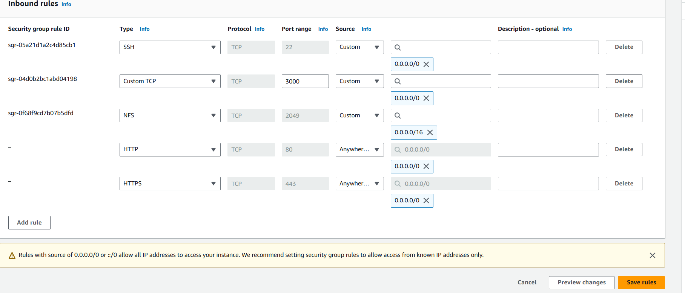  
   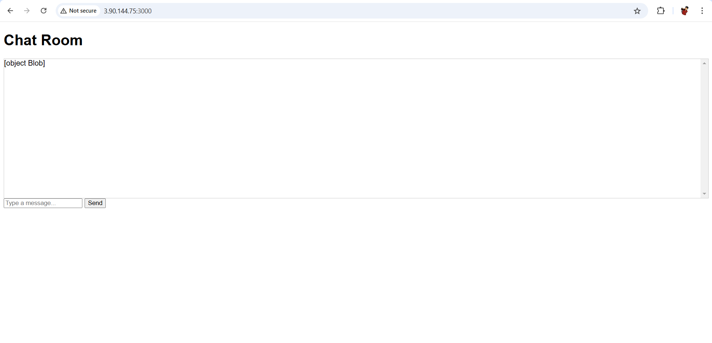

---

