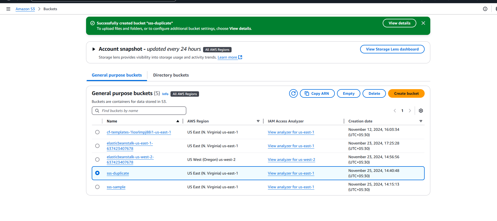
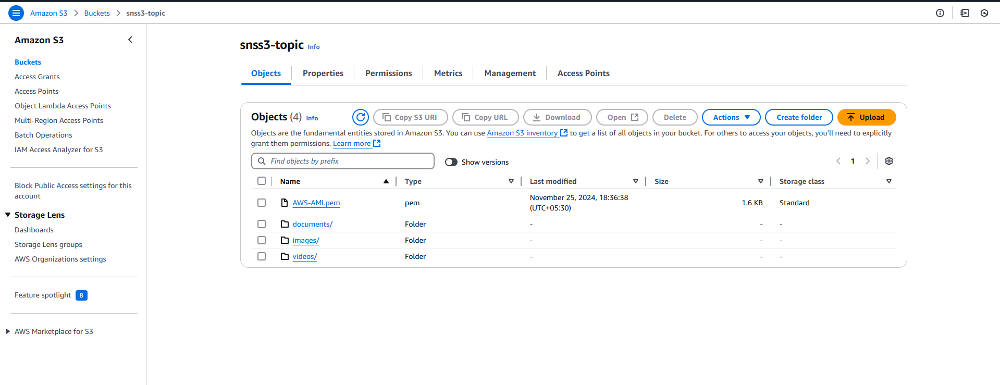
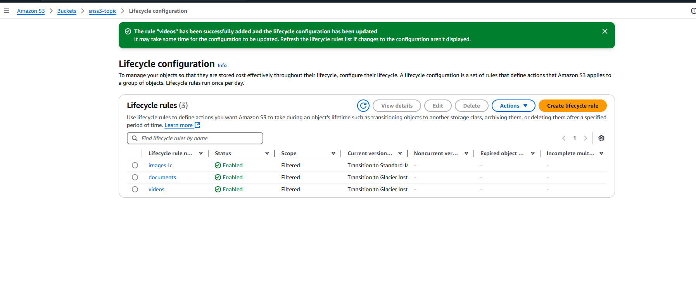
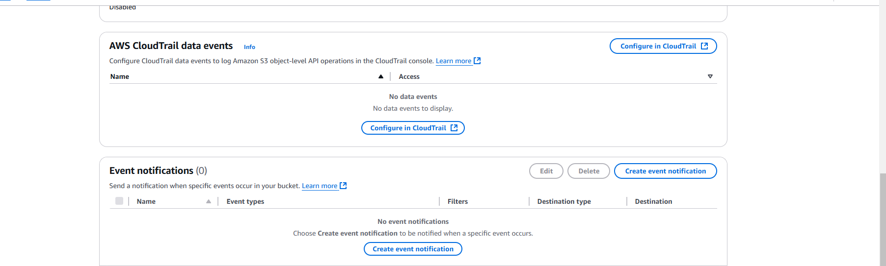
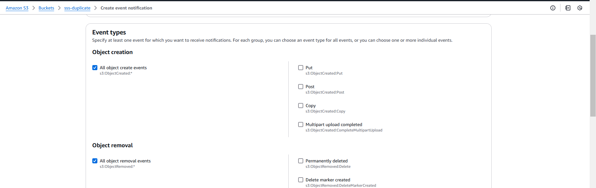
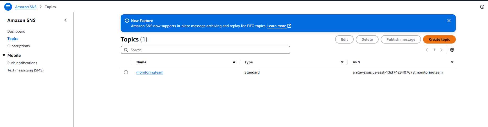

---

# **Amazon S3 Multimedia Storage Solution Documentation**

### **Real-World Example**
A media company needs to store high-resolution images and video content. The `images/` folder is used for frequently accessed images, while `videos/` are archived after a certain period. Content must be stored securely, accessible only to authorized users, with older files automatically archived for cost efficiency.

---

## **Overview**
This document guides you through creating an **Amazon S3-based solution** to store, manage, and archive multimedia content. The solution includes bucket creation, object versioning, lifecycle management, encryption, and automation.

---

## **Objectives**
- Create and configure an S3 bucket with object versioning.
- Organize files using folder structures (prefixes).
- Implement lifecycle policies to optimize costs.
- Secure data using encryption, bucket policies, and access control.
- Automate file management using S3 event notifications.

---

## **Step-by-Step Instructions**

---

### **1. Create an S3 Bucket with Versioning**

1. **Open the S3 Console**  
   Navigate to the AWS Management Console and go to **S3**.

2. **Create a Bucket**  
   Click **Create Bucket** and name it:  
   `multimedia-storage-[yourname]-bucket`.  

3. **Enable Versioning**  
   Under the **Bucket Versioning** section, select **Enable**.  
   This ensures that S3 tracks and saves multiple versions of an object.

   

4. **Test Versioning**  
   Upload multiple files with the same name to test how S3 tracks versions.  

---

### **2. Organize Files Using Prefixes**

1. **Create Folders**  
   Within the bucket, create folders for organization:  
   - `images/`
   - `videos/`
   - `documents/`  

2. **Upload Files**  
   Upload sample files into each folder and observe how S3 uses prefixes to simulate directory structures.

     

---

### **3. Implement Lifecycle Policies**

1. **Navigate to Lifecycle Policies**  
   Go to the bucket **Management** tab and click **Lifecycle rules**.

2. **Set Up Rules**:
   - For `images/`, transition objects to **S3 Standard-IA** after 30 days.
   - For `videos/`, transition objects to **S3 Glacier** after 60 days and delete them after 180 days.

3. **Test and Document**  
   - Verify the rules by uploading files and simulating time-based transitions.
   - Document the cost-saving benefits of transitioning storage classes.

   

---

### **4. Enable Server-Side Encryption**

1. **Enable Encryption**  
   Navigate to the **Properties** tab of the bucket and enable server-side encryption:  
   - Use either **S3-managed keys (SSE-S3)** or **AWS KMS keys (SSE-KMS)**.

2. **Document Differences**  
   - SSE-S3: S3 manages encryption keys for you.  
   - SSE-KMS: You manage the encryption keys using AWS Key Management Service.  

     

---

### **5. Configure Access Controls and Bucket Policies**

1. **Add a Bucket Policy**  
   Use the following JSON example to grant read access to a specific IAM role:  
   ```json
   {
       "Version": "2012-10-17",
       "Statement": [
           {
               "Effect": "Allow",
               "Principal": {
                   "AWS": "arn:aws:iam::123456789012:role/MyRole"
               },
               "Action": "s3:GetObject",
               "Resource": "arn:aws:s3:::multimedia-storage-[yourname]-bucket/*"
           }
       ]
   }
   ```

2. **Ensure Public Access Is Blocked**  
   Navigate to the **Permissions** tab and confirm that public access is blocked.

3. **Use ACLs for Specific Permissions**  
   Assign specific permissions using **Access Control Lists (ACLs)**.

     

---

### **6. Set Up Event Notifications**

1. **Configure Event Notifications**  
   Go to the bucket **Properties** tab and set up notifications for:  
   - `s3:ObjectCreated:*`  
   - `s3:ObjectRemoved:*`  

2. **Route Notifications**  
   Send notifications to an **SNS topic** or an email.

3. **Test Automation**  
   Upload and delete files to observe notifications for each action.

   

---

## **Conclusion**
This guide demonstrates how to use Amazon S3 to manage multimedia content effectively. By implementing versioning, lifecycle policies, encryption, access control, and event notifications, you can achieve a secure, cost-effective, and automated storage solution.

---

