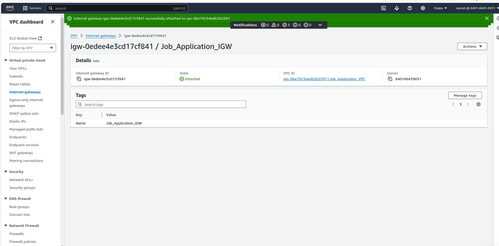
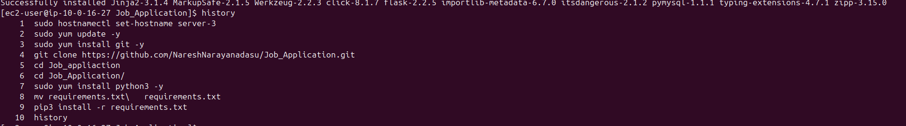

---

## **Step 1: VPC Creation**

### 1. **Created a VPC**
I started by creating a VPC with a CIDR block of `10.0.0.0/16` to provide a logically isolated environment for hosting my application.  
   

### 2. **Created an Internet Gateway (IGW)**
Next, I created an Internet Gateway and attached it to the VPC. This allowed resources in the VPC to connect to the internet.  
   

### 3. **Created Subnets**
I then created two subnets:
- **Public Subnet:** CIDR block `10.0.0.0/20` for resources that need internet access, such as the Load Balancer.  
- **Private Subnet:** CIDR block `10.0.16.0/24` for instances and the RDS database that do not require direct internet access.  
   

### 4. **Configured Route Tables**
- **Public Route Table:** I created a route table, associated it with the Public Subnet, and added a route (`0.0.0.0/0`) to the IGW for internet access.  
   

- **Private Route Table:** I created another route table for the Private Subnet and ensured it did not have a direct route to the IGW to maintain isolation.  
   

---

## **Step 2: EC2 Instances for the Application**

### 1. **Launched EC2 Instances in the Private Subnet**
I launched **three EC2 instances** in the Private Subnet using Amazon Linux 2. For these instances:
- I assigned IAM roles with permissions for S3 and RDS access.  
     
- I configured the Security Group to allow only inbound traffic from the Load Balancer.  
     
- I also created a NAT Gateway in the Public Subnet to allow private instances to access the internet for updates and installations.  
   

### 2. **Deployed the Python Application on EC2 Instances**
To deploy the application:
- I connected to each EC2 instance, installed the necessary packages, and cloned my GitHub repository:  
   ```bash
   sudo yum update -y
   sudo yum install git python3 -y
   git clone https://github.com/NareshNarayanadasu/Job_Application.git
   cd Job_appliaction
   pip3 install -r requirements.txt
   ```
- I verified the deployment:  
   - Instance 1:  
       
   - Instance 2:  
     

### 3. **Configured the Application**
I updated the application code to connect to the RDS database using its private DNS endpoint.

---

## **Step 3: RDS (Relational Database Service)**

### 1. **Created the RDS Instance**
- I created an RDS instance with MySQL as the database engine and configured it as follows:
  - Subnet Group: Associated it with the Private Subnet.  
      
  - Security Group: Allowed inbound traffic only from the private IPs of the EC2 instances.  
      
  - Publicly Accessible: Set to `No`.  
  - Saved the endpoint for use in the application.  
    

### 2. **Configured the Database**
I logged into the database, created the required schemas and tables for the application.

---

## **Step 4: Load Balancer**

### 1. **Created an Application Load Balancer (ALB)**
I deployed an ALB in the Public Subnet and configured it with the following:
- Listener: Forwarded incoming HTTP traffic to the target group.  
   

### 2. **Configured the Target Group**
I added the private EC2 instances as targets to the target group.  
   

### 3. **Domain Configuration**
Using Route 53, I created a custom domain and configured an alias record pointing to the ALB DNS endpoint.

---

## **Step 5: Auto Scaling**

### 1. **Created a Launch Template**
I created a launch template for the EC2 configuration, ensuring consistency across all instances.  
   

### 2. **Set up an Auto Scaling Group (ASG)**
I configured the ASG with the following:
- **Desired Capacity:** 3  
- **Minimum Capacity:** 2  
- **Maximum Capacity:** 6  
   

### 3. **Added Scaling Policies**
I defined scaling policies to adjust the number of instances based on CPU utilization:
- Add instances if CPU utilization > 70%.  
- Remove instances if CPU utilization < 30%.

---

## **Step 6: Monitoring and Notifications**

### 1. **Enabled CloudWatch Metrics**
I set up monitoring for EC2 and RDS to track CPU, memory, disk, and network usage.

### 2. **Set up Alarms and Notifications**
I configured CloudWatch alarms for high CPU usage and integrated them with SNS to send email notifications.  
     
   

---

---

## **Step 7, 8, and 9: Not Completed**

I could not proceed with configuring the CDN (Step 7), testing with the custom domain (Step 8), or performing a comprehensive security review (Step 9) as a domain was unavailable to me. Once I acquire a domain, I plan to complete these steps. 

--- 
